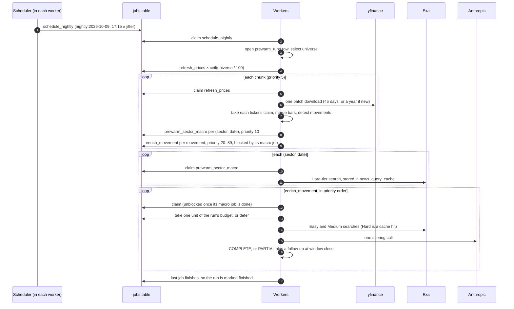

# Pre-warming

Metrix used to do all its work on demand. The first request for a ticker paid for
everything: a yfinance download, then for each movement up to three Exa searches and
one LLM scoring call, often minutes in all. That work ran in FastAPI's
`BackgroundTasks`, inside the API process, so it was lost on restart, unbounded in
concurrency, invisible, and never retried. Nothing controlled when the expensive work
happened or how fast external APIs were called.

Pre-warming computes, at a chosen time, the data users are likely to ask for, so that
popular tickers are already warm when they do. It rests on one property of the domain.
A past movement whose news window has closed and been enriched never needs enriching
again, and prices are cheap (yfinance downloads a hundred symbols in one call), while
news enrichment is the expensive part. So the nightly run refreshes prices broadly and
cheaply, and spends enrichment only on new movements of tickers people actually look
at.

This document covers, in order: two fixes that had to come first; the durable job
queue that replaced `BackgroundTasks`; ingestion split into steps the queue can run
separately; demand tracking, which decides what is worth warming; and the nightly run
itself, with its priorities, rate limits, budget and trade-offs.

## Fixes that came first

### The Hard-tier cache was not shared across tickers

The Hard-tier search is meant to be company-free, so that every ticker in a sector on
a given date produces the same request and they all share one `news_query_cache` row.
The query text was company-free. The request was not. `build_tier_queries` attached
one `summary_query` to all three tiers, and that summary named the company and the
size of its move ("Does this article explain why NVIDIA stock moved -4.10% on
2026-06-05?"). `NewsSearchRequest.cache_fingerprint` hashes every field of the request,
so the Hard-tier key differed per ticker and the sharing described in the code, the
README and the submission write-up never happened. Each ticker paid for its own macro
search.

The Hard tier now has its own summary question, which depends only on sector and date:
"Which macroeconomic, political or regulatory developments in this article would move
{sector} stocks around {date}?" Easy and Medium keep the company-specific summary. A
test ingests two differently named companies in the same sector and asserts exactly one
upstream Hard-tier call.

This has a cost. Exa writes each result's summary against the summary question, and
the scorer reads that summary. For macro articles it now reads a sector-level summary
instead of one written for this company's move. The scorer is still told the company,
the size and the direction of the move in its own prompt, and deciding whether a macro
event explains this particular move was always its job, so the loss is a less targeted
snippet, not lost information. The gain is one macro search per sector per day instead
of one per ticker, which is the property the nightly run depends on.

Two workers can now miss on the same cache key at the same moment and both insert it.
The insert runs inside a savepoint, and a unique-constraint violation is logged and
treated as a cache hit, so the losing worker's transaction survives.

### Recent movements were marked complete before their news window closed

A movement's news window runs from three days before the move to one day after it.
Enrichment set `news_status = complete` as soon as it ran, and re-ingestion skips
complete movements. A move enriched on the evening it happened therefore never picked
up the next day's articles, which are often the ones that explain it. The response
cache had the same blind spot: it used a flat 24-hour TTL on the grounds that a past
window's answer never changes, which is only true once the window has closed.

Each movement now stores `news_window_closes_at`, the window's last instant plus
`NEWS_WINDOW_GRACE_HOURS` (default 6) for indexing lag. Enrichment that runs before
then marks the movement `partial`; enrichment after it marks it `complete`. A partial
movement is not re-enriched while its window is still open, and is re-enriched as soon
as it has closed. Today that happens on the next ingestion of the ticker. Once the job
queue exists, the partial pass will enqueue its own follow-up to run at
`news_window_closes_at`.

Re-enrichment re-scores the whole candidate set and replaces the previous verdict.
Articles and links are upserted, so nothing is duplicated, and a link the new pass no
longer supports is removed rather than left with its old score. If the second search
comes back empty, the earlier links are kept, since finding no evidence is not evidence
against them.

The cache TTL now follows the same rule. A response for a closed window is kept for
`NEWS_CACHE_CLOSED_WINDOW_TTL_DAYS` (90). A response for an open window is kept for
`NEWS_CACHE_OPEN_WINDOW_TTL_HOURS` (2), and never past the moment the window closes, so
the first search after closing gets the final answer.

Each enrichment attempt also increments `news_attempts`. A movement that has failed
`NEWS_MAX_ATTEMPTS` times (default 3) is no longer retried automatically; `refresh=true`
still retries it. Without this, a movement whose news can never be fetched would cost a
search and a scoring call on every run.

The migration backfills `news_window_closes_at` and moves rows the old code got wrong,
complete movements whose `news_fetched_at` is earlier than their window close, back to
`partial`, so they are picked up again. `news_status` is a VARCHAR with no CHECK
constraint, so the new value needed no DDL.

## The job queue

All background work now goes through a job queue in Postgres, including the on-demand
ingestion that used to run in FastAPI's `BackgroundTasks`. `BackgroundTasks` ran inside
the API process: work was lost on restart, nothing bounded how much ran at once,
nothing showed what was running, and nothing retried a failure.

The queue is a `jobs` table rather than Redis or Celery. It adds no infrastructure, and
a job can be enqueued in the same transaction as the data that made it necessary: when
an enrichment marks a movement PARTIAL, the movement's new status and its follow-up job
commit together or not at all. What it gives up is throughput, which does not matter
here. External rate limits cap the useful rate at a few jobs per second.

The code is in `app/services/queue.py`, with the handlers in
`app/services/job_handlers.py` and the worker in `app/worker.py`.

### Enqueueing and deduplication

Every job has a `dedupe_key` that names the work, such as `ingest:NVDA` or `enrich:42`.
A partial unique index allows at most one queued or running job per key. Enqueueing a
key that already has a queued job adds nothing; it lowers that job's priority number to
the smaller of the two and moves its `run_after` to the earlier of the two. That is how a
user asking for a ticker already queued for tonight makes it run now. A key whose job
is already running returns that job unchanged. Finished jobs keep their keys as history
and do not block new work.

The follow-up for a PARTIAL movement uses its own key, `enrich:{id}:followup`. It is
enqueued from inside the running `enrich:{id}` job, and under that same key the dedupe
would return the running job and the follow-up would never exist.

Two enqueuers racing on one key both see no active job and both insert; the unique
index rejects the second, which then finds and returns the first. The insert runs in a
savepoint, so the rejected one does not abort the caller's transaction.

### Claiming

Lower priority numbers run first, then the earliest `run_after`, then the oldest job.
On Postgres a claim is a single statement:
`UPDATE jobs SET status = 'running', … WHERE id = (SELECT id … ORDER BY priority,
run_after, id LIMIT 1 FOR UPDATE SKIP LOCKED) RETURNING id`. `SKIP LOCKED` makes
concurrent claimers step over rows another transaction already has, instead of waiting
on them, so N workers take N different jobs. SQLite, used by the test suite, has no row
locks, so there the claim picks a candidate and then takes it with an UPDATE that only
succeeds if the job is still queued. This is the same pattern
`ingestion.claim_ingestion` uses. The queue tests run against both databases when
Postgres is available, because the two claims are different statements and must behave
the same.

A job is not claimable before its `run_after`, or while an active job holds its
`blocked_by_key`. Any terminal state of the blocker releases its dependents, including
`dead`. A dependent then does the blocked work itself, which is slower but never hangs.

### Failure, retries and locks

A failed attempt goes back to `queued` with a later `run_after`: the base delay doubles
per attempt, up to a ceiling, and is scaled by a random factor of ±25% so jobs that
failed together do not all retry in the same second. After `max_attempts` the job is
`dead`. Errors that cannot succeed on a retry go straight to `dead`. These are an
unknown symbol, a missing key, and a key the provider rejects. They are marked with a
`permanent` flag on the domain exception rather than recognised by their message text.

A worker that dies leaves its jobs `running`. Each worker reaps jobs whose lock has not
been refreshed within `JOB_LOCK_TIMEOUT_MINUTES` and requeues them. The orphaned
attempt counts, so a job that crashes its worker every time it runs ends up `dead`
instead of cycling forever. While a job runs, the worker refreshes its lock every
`JOB_HEARTBEAT_SECONDS`, so a slow but healthy job is never reaped and run twice. Every
transition after the claim is a conditional UPDATE that also matches `locked_by`. If a
job was reaped and claimed by another worker while the first was still running it, the
first worker's late result changes nothing.

The status list includes `failed` alongside `dead`, but nothing writes `failed` at the
moment: both permanent errors and exhausted retries end as `dead`. Anything that
treats terminal states, such as unblocking dependents, treats the two alike.

Every status or progress change sends `NOTIFY job_events, '<job id>'` on Postgres in the
same transaction, so a listener only hears about committed changes. Nothing listens
yet. It is groundwork for a live frontend.

### The worker

`python -m app.worker`, or the `worker` service in `docker-compose.yml`, runs
`WORKER_CONCURRENCY` claim loops in one process. Each loop runs one job at a time in its
own session and sleeps for a jittered poll interval when nothing is due. Workers only
claim the job kinds they have handlers for, so kinds added by later stages wait in the
queue until a worker that knows them is deployed.

Priority alone does not stop a user from waiting. If every loop is busy with a
30-second nightly enrichment, a cold ticker is first in line but still waits for one to
finish. `WORKER_INTERACTIVE_SLOTS` of the loops therefore only claim priority-0 jobs,
the ones a user is waiting on, and sit idle otherwise. The other loops claim anything.

Handlers report progress, such as `{"stage": "enriching", "done": 4, "total": 10}`, by
recording it on their context. The handler never writes it to the database itself. A
per-job keepalive task writes the latest value along with the lock heartbeat, so
reporting progress can never block, slow or fail a handler. The final value is saved
in the same transaction that marks the job succeeded.

On SIGTERM the loops stop claiming, and in-flight jobs get
`WORKER_SHUTDOWN_TIMEOUT_SECONDS` to finish. Jobs still running after that are
cancelled and released back to the queue with their attempt refunded, so a deploy never
costs a job one of its retries. Compose gives the worker a longer `stop_grace_period`
than that timeout.

### Two writers, one ticker

The ticker claim (`ingestion.claim_ingestion`) is still the only thing that stops two
runs from writing one ticker's bars and movements at once. The API no longer takes it
when it enqueues, because a job can sit in the queue for longer than a claim stays
valid. The `ingest_ticker` handler takes it when it runs. If a `wait=true` request is
already ingesting that ticker inline, the job succeeds without doing anything, since
that request is doing the same work. An `enrich_movement` job writes only its own
movement and needs no ticker claim. If the movement has been deleted by the time the
job runs, because a price refresh re-ran detection and dropped it, the job succeeds as
a no-op.

### The enrichment budget

`prewarm_runs` holds one row per nightly run, including that run's enrichment budget.
A unit is taken with one conditional UPDATE,
`… SET enrichments_used = enrichments_used + 1 WHERE enrichments_used <
enrichment_budget`, which commits at once. Parallel spenders therefore cannot overspend,
and nobody holds the run's row lock while enriching. A run is finished when it has no
queued or running jobs left. Each job checks this after committing its own final
state, so when the last two jobs finish at the same moment, at least one of them sees
the other as done.

## Ingestion as composable steps

`ingest_ticker` used to do everything in one function. It is now two steps that also
run on their own. `refresh_prices` stores bars, applies the company profile, re-runs
detection and upserts movements; it is cheap, and batchable across tickers.
`enrich_movement` searches, scores and links news for one movement; it loads its own
ticker and peers, and is the expensive part. `ingest_ticker` is still the on-demand
path: it fetches one ticker's year of prices, runs `refresh_prices`, then enriches the
movements its budget allows. It shares one peers lookup across those movements, as
before, so on-demand behaviour is unchanged.

### Batched prices

`prices.fetch_price_histories` downloads up to `PRICE_BATCH_SIZE` symbols per
`yf.download` call and returns, per symbol, either its history or the error that symbol
alone hit, so a delisted name never costs the rest of its batch. The company profile is
one HTTP call per symbol, so it is fetched only for tickers with nothing stored yet.

`yf.download` pads every symbol to the union of all dates, so a symbol with no data
arrives as rows of NaN, and it records per-symbol errors only in its log. Without
those errors, a timeout on one symbol looks the same as an unknown symbol, and the
queue treats an unknown symbol as a permanent error. The batch fetch therefore calls
yfinance's internal `_download_impl` with its own context object, which collects the
errors. An error that reads like an unknown symbol, or no data with no error, becomes
`TickerNotFoundError`; any other error is a transient `PriceDataError`. yfinance is
pinned below 2.0, a test fails if the internal API moves, and if it is missing at run
time the code falls back to the public function.

### Refreshing a short window

A ticker that already has stored bars only needs its recent prices again. The nightly
refresh fetches `PREWARM_PRICE_LOOKBACK_DAYS` (45) and merges them with what is stored,
and detection runs over the merged series, so the newest days' rolling volatility is
computed from the full 20 days before them, not from whatever the short fetch returned.

That merge has a trap the brief did not anticipate. Adjusted closes are revised
retroactively: a dividend rescales every earlier adjusted close, and a split rescales
every earlier price. Bars stored last month and bars fetched today can sit on different
bases. Joined naively, a 2-for-1 split appears as a -50% movement at the seam. So
`merge_price_bars` compares the oldest fresh day that is also stored. If the two
disagree by more than rounding, every stored bar before the fresh window is rebased by
that ratio: the adjusted close by the adjusted ratio, raw prices by the raw-close ratio
(which yfinance also split-adjusts), and volume inversely. The rebased bars are written
back, so the stored history stays on one basis. This only works if the fresh window
overlaps the stored bars. When it does not, the refresh logs `price_history_gap`, and
the caller is responsible for sizing the window to cover the gap since the last
refresh.

Merging also changes one thing about on-demand ingestion: a stored movement older than
the fetched year is no longer deleted on re-ingest, because detection now covers every
stored bar rather than only the fetched ones.

Writing this exposed an older bug. `_upsert_price_bars` compared the stored
`NUMERIC(18,6)` adjusted close with the unrounded fetched float, so every bar looked
changed and was rewritten on every ingestion. It now compares at the column's
precision, so a refresh with nothing new writes nothing.

### Scoring as request and result

`relevance.score_candidates` is now `build_scoring_request` (prompt and output schema),
the model call, and `apply_scoring_result` (report to scored candidates). This mirrors
the `execute`/`parse` split on news providers. Both halves are pure, so a batch scorer
can build requests tonight and apply results when the batch returns.

## Demand: what is likely to be asked for

Pre-warming spends its budget on the tickers users are likely to request, and the
evidence is what they have requested. Every `GET /tickers/{symbol}` records a hit, and
so does every chat turn that resolves a ticker. Ticker requests are recorded before
ingestion is decided, so a request for a cold ticker counts; it is committed at once,
so it does not depend on how the rest of the request goes. A chat turn's hit commits
with the turn, so a turn whose model call fails does not count. Recording runs in a
savepoint and is best-effort: a failure is logged and the request carries on.

Popularity is an exponentially decayed hit count. On each hit,
`score = score · exp(−Δt/τ) + 1` with `τ = DEMAND_HALF_LIFE_DAYS / ln 2`, so a request
counts half as much a half-life (7 days by default) later. A ticker asked for once a
day settles around 10.6, and one asked for once a month ago has all but faded. The
stored score is as of its last update, so readers decay it to the present before
ranking. Otherwise a ticker hit fifty times two months ago would still outrank one hit
ten times last month.

On Postgres a hit is a single `INSERT … ON CONFLICT DO UPDATE` that computes the decay
from the row as it is at write time, so concurrent hits on one symbol all count.
Elsewhere (SQLite in the tests) it is read, decay in Python, write, which is correct
there because SQLite serializes writers. Both run in the test suite when Postgres is
available.

Demand lives in its own `ticker_demand` table, keyed by symbol, rather than in columns
on `tickers`. It is written on every request, and the ticker row is the one ingestion
claims. Keeping them apart means a page view never waits on an ingestion holding that
row. A symbol is also demanded before it has a ticker row, and `tickers.updated_at`
keeps meaning "the data changed" rather than "someone looked".

### The universe

`select_prewarm_universe` is the union of three sets: the seed symbols
(`PREWARM_SEED_SYMBOLS` plus the file `PREWARM_SEED_FILE`, by default
`data/seed_universe.txt`, a hand-picked list of about forty large caps); the
`PREWARM_TOP_N` most popular tickers by decayed popularity; and anything requested in
the last `PREWARM_RECENT_DAYS`. Tickers whose last ingestion failed with a permanent
error are removed, even if seeded. Each entry carries its decayed popularity, for
prioritising its jobs.

Which failures are permanent is now recorded on the ticker
(`tickers.ingest_error_permanent`), from the same `permanent` flag the queue uses, and
it is cleared by the next successful ingestion. A request for a nonsense symbol
therefore costs one failed ingestion and then drops out of the universe, instead of
being retried every night. A transient failure keeps its ticker in the universe. Rows
that failed before this column existed are treated as transient until they fail again.

## The nightly run

### When

US equities close at 16:00 New York time. The run starts at `PREWARM_RUN_AT`, 17:15 by
default, once yfinance has settled the day's bars, Monday to Friday. The schedule is
computed in New York time with `zoneinfo`, so it stays at 17:15 on the wall clock across
both daylight-saving changes; in UTC it moves between 21:15 and 22:15.
`schedule.next_run_after(now)` and `schedule.latest_run_at(now)` are pure functions,
tested across both 2026 changes and over weekends.

Market holidays are not special-cased. The run is idempotent: on a holiday yfinance
has no new bar, detection finds nothing new, and the run refreshes some prices and
spends nothing on news. A holiday calendar would save those few cheap calls, at the
cost of a dependency and a list that needs updating every year.

Each worker runs a small scheduler. Whenever it wakes, it enqueues a `schedule_nightly`
job for the most recent scheduled time, unless that trading date already has a run,
and then sleeps until the next one, at most five minutes at a time. Enqueueing the most
recent run, rather than only at the exact instant, means a worker that was down at
17:15 catches up when it starts. Any number of replicas can do this safely. The job's
`nightly:{date}` dedupe key folds simultaneous attempts into one job. The run row's
unique `trading_date` makes a later duplicate a no-op. The job's `run_after` is
jittered by up to `PREWARM_JITTER_SECONDS` either way, so the run does not start at
exactly 17:15:00.

`POST /admin/prewarm` starts a run immediately. It is guarded by the `X-Admin-Token`
header and disabled while `ADMIN_TOKEN` is unset. A date that has already run answers
`409`; pass another `trading_date` to run again.

### What it does

The first stage is cheap fan-out. `schedule_nightly` opens the run's `prewarm_runs`
row, selects the universe, and enqueues one `refresh_prices` job per `PRICE_BATCH_SIZE`
symbols, most popular first. Each `refresh_prices` job batch-downloads its chunk's
prices: the 45-day window for tickers it already has, a full year and the company
profile for new ones. It takes each ticker's ingestion claim, as an interactive
ingestion does; if a user's ingestion holds it, the ticker is skipped, because that
run is doing the same work. It then refreshes bars and movements. For every movement
that needs news, under the same rule as the on-demand path, it enqueues the sector's
`prewarm_sector_macro` job and an `enrich_movement` job blocked behind it. One bad
symbol never fails a chunk. An unknown symbol is recorded as a permanent failure,
which removes it from future universes. Only a chunk in which every symbol failed
transiently raises, so the queue retries the whole chunk.

The second stage is enrichment, the expensive part. `prewarm_sector_macro` runs one
sector's Hard-tier search for one date. Its only product is the cache row, so every
enrichment in that sector and date finds its macro search already answered. The
enrichments then drain in priority order.

### Priorities

Lower runs first:

- 0: interactive, a user is waiting.
- 5: the nightly fan-out, `schedule_nightly` and `refresh_prices`. They are cheap, and
  everything else waits on them.
- 10: `prewarm_sector_macro`, one search that unblocks many enrichments.
- 20–59: nightly enrichment for tickers with demand.
- 60–89: nightly enrichment for seed tickers nobody has asked for yet.
- 90: PARTIAL follow-ups, which wait for a fixed time anyway.

`prewarm.enrichment_priority` maps popularity and move size into the 20–59 band. Each
power-of-two step of popularity is one bucket, and four slots within a bucket order
moves of 10%+, 5%+, 3%+ and smaller. Popularity therefore decides, and move size only
breaks ties. A ticker asked for once a day lands around 44–47; one asked for fifty
times a day lands at the top of the band.

When someone requests a ticker whose movements are still owed news, those enrichments
are enqueued at priority 0 under the same `enrich:{id}` key as the nightly job. If the
nightly job is still queued, it is pulled forward rather than duplicated.

### Rate limits

The bottleneck is the providers' rate limits, not CPU. Every outbound call acquires a
token from its provider's bucket first (`app/services/ratelimit.py`), configured by
`EXA_MAX_RPS`, `ANTHROPIC_MAX_RPM` and `YFINANCE_MAX_RPS`, allowing bursts of up to one
second's worth. On a 429, Exa and Anthropic also stop their bucket for the
`Retry-After` time (10 seconds if none is given). Every concurrent call to that
provider in the process then waits, instead of each discovering the 429 separately.
The provider's own short retries cover a blip; past that, the movement fails, its job
fails, and the queue retries it with backoff instead of burning retries in a tight
loop.

The buckets are per process. With N worker processes, configure each with the
provider's limit divided by N. The upgrade path is a shared bucket, either a row per
provider in Postgres updated with the queue's conditional-UPDATE pattern or a Redis
token bucket. Neither is built, because at one or two workers the arithmetic is easy.

### The budget

`PREWARM_MAX_ENRICHMENTS_PER_RUN` (300) caps how many movements a run enriches. Every
candidate is enqueued. Each takes one unit of budget when it starts, through the
atomic conditional UPDATE on `prewarm_runs`, and not when it is enqueued, so the budget
is spent in priority order. A job that finds the budget gone succeeds with
`progress = {"outcome": "deferred"}`. Its movement stays PENDING and is enriched on
the next night or as soon as someone asks for its ticker. The run counts used and
deferred units, and both show in `/admin/queue` and in `prewarm_run_finished`.
Interactive jobs and PARTIAL follow-ups never pay. Neither does a nightly job that a
user's request has pulled forward to priority 0. The job records that it has paid in
its payload, in the same transaction, so a retried job does not pay twice.

### Observability

The queue logs `job_enqueued`, `job_claimed`, `job_succeeded`, `job_failed` (retry
scheduled) and `job_dead`. A run logs `prewarm_run_started` (universe size, chunks,
budget), `refresh_chunk_complete` per chunk, `enrichment_deferred` per deferral, and
`prewarm_run_finished` (universe size, movements found, enrichments queued, used and
deferred, duration). The existing `exa_search` and `llm_call` events carry cost and
token usage. `GET /admin/queue` shows the same state on demand.

## Trade-offs

Postgres instead of Redis and Celery. One more table instead of one more service, and
a job can commit atomically with the data that caused it. A broker would offer higher
throughput and ready-made tooling, but throughput is capped by the providers' rate
limits at a few jobs per second, which Postgres handles easily. The queue is small
enough to read in one sitting, which matters for a project whose design has to be
explained.

Per-process instead of shared rate limits. Correct with one worker and easy to
configure with a few. Past that, a shared bucket is the next step.

No holiday calendar. A holiday run costs a few cheap price calls and finds nothing,
and a calendar is a dependency with a list to maintain.

Sync instead of batch scoring. Overnight scoring has no user waiting, so it suits the
Anthropic Message Batches API, at roughly half the per-token price with results
arriving within hours. Scoring is already split into `build_scoring_request` and
`apply_scoring_result` to keep that option open. Batching is not built: it adds a job
that submits and a job that polls, and the nightly run takes longer to finish.
Interactive scoring would stay synchronous either way.

A sector-level macro summary. Sharing the Hard-tier cache row across a sector requires
a summary question that names no company, so the scorer reads a sector-level summary of
a macro article instead of one written for this company's move. It still knows the
company and the move from its own prompt. The trade is one macro search per sector and
date instead of one per ticker.
